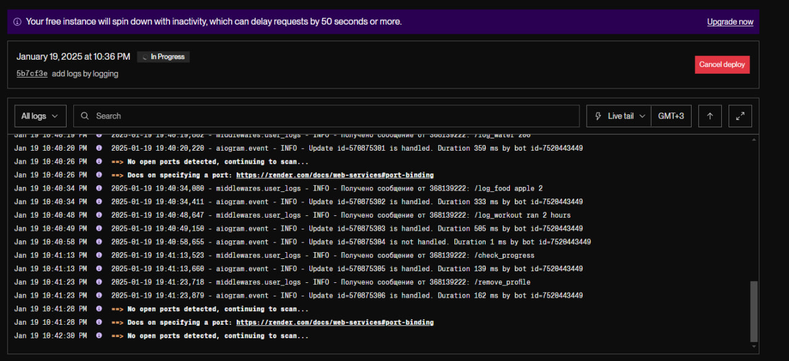
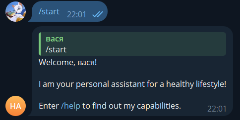
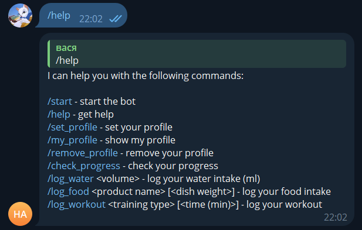
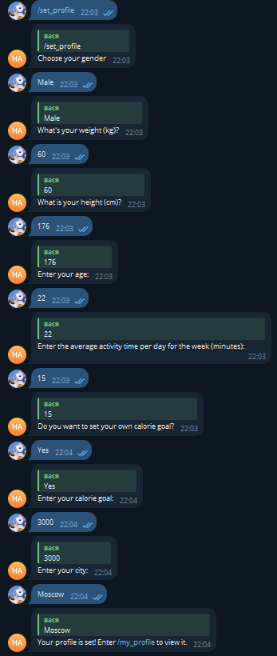
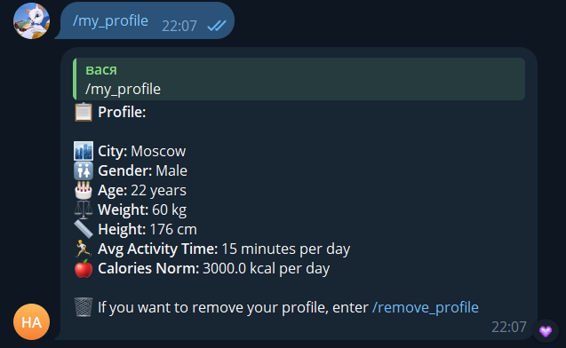
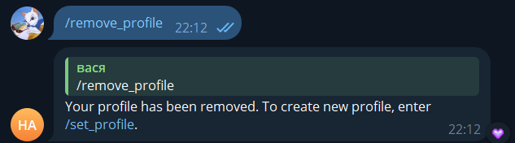
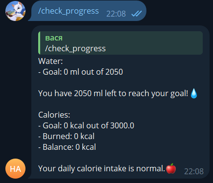
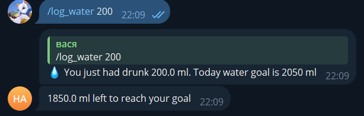
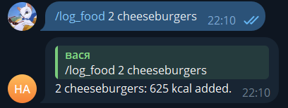
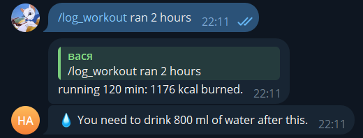

# health-assistant-bot

## Описание
Этот Telegram-бот помогает отслеживать ваше здоровье, включая потребление воды и калорий.

## Установка
1. Клонируйте репозиторий:
    ```bash
    git clone https://github.com/yourusername/health-assistant-bot.git
    cd health-assistant-bot
    ```

2. Создайте файл .env и добавьте ваши API ключи:
    ```properties
    BOT_TOKEN=your_telegram_api_key
    OPENWEATHER_API_KEY=your_openweather_api_key
    EDAMAM_APP_ID=your_edamam_app_id
    EDAMAM_APP_KEY=your_edamam_app_key
    NUTRITIONIX_API_ID=your_nutritionix_api_id
    NUTRITIONIX_API_KEY=your_nutritionix_api_key
    ```

## Запуск через Docker
1. Постройте Docker образ:
    ```bash
    docker build -t my_telegram_bot .
    ```

2. Запустите контейнер:
    ```bash
    docker run -d --name my_telegram_bot my_telegram_bot
    ```

## Использование
После запуска бота, вы можете отправить команду `/start` в Telegram, чтобы начать взаимодействие с ботом.

## Деплой
[render.com]](https://render.com/)

## Демонстрация работы бота:

### /start

### /help

### /set_profile

### /my_profile

### /remove_profile

### /check_progress

### /log_water

### /log_food

### /log_workout

## Скринкаст
